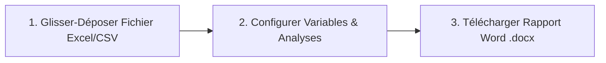

# 📊 Analytix-GUI (Interface Web No-Code)

[](https://www.r-project.org/)
[](https://shiny.posit.co/)
[](https://rstudio.github.io/bslib/)
[](LICENSE)

**`analytix.gui`** est une application web interactive **No-Code** construite avec R Shiny et `bslib`. Elle embarque le moteur de calcul du package R [`analytix`](https://github.com/elidopremier/analytix) en arrière-plan pour permettre aux cliniciens non-codeurs, aux étudiants et aux clients de **Redaklab** de glisser-déposer leur fichier Excel ou CSV et d'obtenir un rapport Word (`.docx`) nettoyé et mis en forme sans écrire la moindre ligne de code R.

---

## 🎯 Public Cible

1. **🏥 Cliniciens & Chercheurs en Santé** : Générez des tableaux descriptifs (Tableau 1 de publication) et des analyses bivariées à partir de vos registres patients ou données d'essais cliniques.
2. **🎓 Étudiants & Thésards** : Réalisez les analyses statistiques de vos mémoires ou thèses d'exercice sans passer des semaines à apprendre R.
3. **💼 Clients & Partenaires Redaklab** : Interface fluide et sécurisée pour automatiser la chaîne de traitement **Excel ➔ Rapport Word (.docx)**.

---

## ✨ Fonctionnalités Clés

- 📁 **Glisser-Déposer & Import Polyvalent** : Chargez directement vos fichiers Excel (`.xlsx`, `.xls`), CSV ou RDS. Support de la sélection dynamique des feuilles Excel.
- 🧹 **Nettoyage Automatique** : Détection et normalisation automatique des noms de colonnes (`snake_case`), suppression des espaces superflus et diagnostic immédiat des données manquantes (`NA`).
- 📊 **Analyse Univariée Interactive** :
  - Variables continues : Moyenne ± Écart-type et Médiane [IQR Q1-Q3].
  - Variables catégorielles & binaires : Effectifs ($N$) et Pourcentages ($\%$).
  - Échelles de Likert et visualisations graphiques interactives (`ggplot2`).
- 🔀 **Analyse Bivariée & Modélisation** :
  - **Tableau 1 de Comparaison de Groupes** : Tests du Chi², Fisher, t-Test de Student, Mann-Whitney, ANOVA ou Kruskal-Wallis appliqués automatiquement.
  - **Tableau d'Odds Ratios (OR)** : Régression logistique bivariée avec Odds Ratios bruts et IC à 95%.
- 📝 **Exportation Word (.docx) Prêt pour Publication** :
  - Génération d'un document Word structuré contenant des tableaux natifs `flextable` formatés selon les normes scientifiques francophones.
  - Personnalisation du titre, de l'auteur et sélection des sections à inclure.

---

## 🏗️ Structure du Projet

```
analytix.gui/
├── app.R                       # Application principale Shiny (UI & Server)
├── DESCRIPTION                 # Métadonnées et dépendances R
├── Dockerfile                  # Configuration pour conteneurisation Docker / Cloud Run
├── README.md                   # Documentation officielle du projet
├── www/
│   └── style.css               # Styles CSS personnalisés (Thème Bslib & Redaklab)
└── R/
    ├── mod_import.R            # Module 1 : Importation, typage et prévisualisation
    ├── mod_univariate.R        # Module 2 : Analyse univariée & Graphiques
    ├── mod_bivariate.R         # Module 3 : Comparaisons bivariées & Modélisation
    └── mod_export.R            # Module 4 : Génération et téléchargement du rapport Word
```

---

## 🚀 Prise en Main Rapide

### Option 1 : Lancement local dans R / RStudio

1. Clonez ce dépôt GitHub :
   ```bash
   git clone https://github.com/elidopremier/analytix.gui.git
   cd analytix.gui
   ```

2. Assurez-vous que le package `analytix` est installé (ou situé dans le dossier parent) :
   ```r
   # Si analytix est publié sur GitHub :
   devtools::install_github("elidopremier/analytix")
   ```

3. Lancez l'application Shiny :
   ```r
   shiny::runApp()
   ```

---

### Option 2 : Déploiement Docker

Pour exécuter `analytix.gui` dans un conteneur Docker autonome (port 3838) :

```bash
# 1. Binder l'image Docker
docker build -t analytix-gui .

# 2. Lancer le conteneur
docker run -p 3838:3838 analytix-gui
```

Accédez ensuite à l'application sur `http://localhost:3838`.

---

### Option 3 : Déploiement sur ShinyApps.io

Vous pouvez déployer cette application directement sur [ShinyApps.io](https://www.shinyapps.io/) en exécutant depuis RStudio :

```r
rsconnect::deployApp(appName = "analytix-gui")
```

---

## 📖 Guide d'Utilisation en 3 Étapes



1. **Onglet 1 - Données** : Chargez votre fichier `.xlsx` ou essayez le dataset démo (`Iris`). Vérifiez l'aperçu et le tableau de structure des colonnes.
2. **Onglets 2 & 3 - Analyses** : Choisissez les variables à décrire ou la variable groupe pour comparer la population d'étude.
3. **Onglet 4 - Rapport Word** : Renseignez le nom de votre projet et cliquez sur **"Télécharger le Rapport Word (.docx)"**.

---

## 👤 Auteur & Crédits

- **Auteur & Développeur** : IDO Esliée (<elidopremier@gmail.com>)
- **Laboratoire / Organisation** : Redaklab
- **Licence** : MIT

---
*Développé avec passion avec R, Shiny & Bslib pour rendre l'analyse de données accessible à tous les professionnels de santé et chercheurs.*
